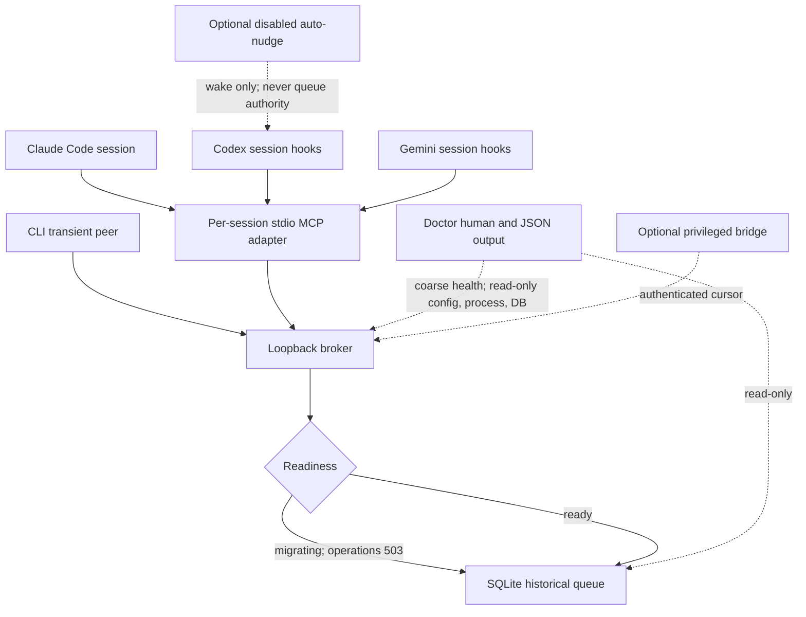
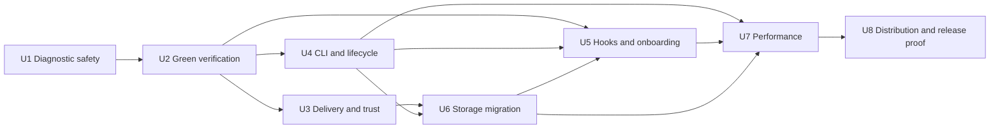

# Claude Peers Reliability and Operator Contract - Plan

## Goal Capsule

- **Objective:** Turn the current README promise into a reproducible, safe, measurable local peer-messaging product for Claude Code, Codex, and Gemini CLI on supported single-user Linux environments.
- **Authority:** This plan replaces the README as the implementation contract until U8 publishes the corrected README. Existing delivery, seat-recovery, naming, and bridge regression tests remain authoritative unless a requirement below explicitly changes their public semantics.
- **Execution profile:** Eight dependency-ordered units, with safety and verification repairs before migration, performance, or documentation rollout.
- **Stop conditions:** Stop the rollout if diagnostics can mutate mail, a database backup or migration cannot be proved reversible, a protected historical regression fails, strict typechecking or tests are red, or the release performance budget is missed.
- **Tail ownership:** U8 owns the final contract inventory, clean-install proof, compatibility notes, and deletion of superseded claims.

---

## Product Contract

### Summary

For this release, Claude Peers is the maintained Manzo downstream distribution for supported single-user Linux environments; upstream contribution remains a separate path. It will remain a loopback-only system with one Bun broker, one SQLite database, and one stdio MCP adapter per client session.
This repair makes that existing shape safe and supportable: read-only diagnostics, authenticated CLI operations, truthful delivery states, convergent hook installation, reversible storage migration, green CI, measured idle cost, and documentation that matches all ten tools and three clients.

### Problem Frame

The runtime has accumulated strong recovery and routing behavior, but its public contract and operational tooling have drifted.
The README installs a different repository, advertises removed behavior, under-documents the tool surface, and promises delivery and hook behavior that the current checkout cannot reproduce.
More seriously, the diagnostic script calls production drain endpoints and can consume or temporarily lease real messages.
The CLI is outside the broker authentication contract, storage declarations contradict intentional history retention, strict compilation fails, and integration tests collide when reviewers run them in parallel.

### Actors

- A1. Operator installs, diagnoses, upgrades, and stops a local Claude Peers fleet.
- A2. Peer agent discovers sessions, sends coordination messages, and interprets queue and acknowledgement state.
- A3. Maintainer changes the broker, adapters, hooks, CLI, schema, tests, and documentation.
- A4. Optional observer or nudge extension consumes the existing authenticated bridge or disabled-by-default auto-nudge surfaces without becoming part of the required core path.

### Requirements

**Safety and delivery integrity**

- R1. Every doctor operation must be read-only with respect to messages, claims, acknowledgements, peer liveness timestamps, and hook telemetry.
- R2. CLI commands must obtain an ephemeral authenticated peer identity, authenticate protected calls, clean up that identity, distinguish failure classes, and return nonzero on every operational failure.
- R3. Broker shutdown must target only the verified broker owner; it must never signal every process associated with a port.
- R4. Public output must distinguish `queued`, `claimed`, and `acknowledged` for existing sender-owned rows; absent rows are `unknown`, and `expired` exists only in purge telemetry/retention aggregates because this plan adds no tombstones.
- R5. Message history must intentionally outlive ephemeral peer rows, and the schema, acknowledgement timestamps, retention anchors, indexes, migration, backup, and rollback must implement that model without fabricating historical delivery time.
- R6. Previously shipped register, rehydration, stale-seat, orphan-mail, naming, delivery-ack, and AP-063 bridge behavior must remain covered and must not be rebuilt as new subsystems.

**Installation and operator contract**

- R7. A clean supported Linux user account must be able to install the current Manzo fork, pin the supported Bun version, register the MCP server, install hooks, verify the installation, and uninstall or roll back without hard-coded operator paths.
- R8. User-level hook installation is the default for cross-repository delivery; project-level installation remains an explicit development or opt-in scope, and duplicate scope wiring must be detected.
- R9. Claude, Codex, and Gemini installers must be byte-level no-ops when already correct, back up only material changes, use collision-safe temporary files, and expose a non-mutating check mode.
- R10. The product contract must document all ten MCP tools, all public limits and retention variables, receiver modes, failure states, optional extensions, and broker-first compatibility behavior.
- R11. The threat model must state that a peer token proves possession of a broker-issued peer identity after an unauthenticated caller supplied metadata and a same-UID live-PID check; it does not prove OS-process provenance, truth, or authority. Message content is potentially adversarial and cannot authorize scope expansion, approval bypass, secret access, tmux inspection, or broker shutdown, and a malicious process under the broker owner's UID is outside the isolation guarantee.
- R12. The current upstream MIT license and attribution must be restored to the fork before it is presented as the canonical distributable repository.

**Quality, observability, and efficiency**

- R13. Strict TypeScript compilation, the full Bun suite, focused CLI/doctor/migration tests, and Linux CI must be green from a locked install.
- R14. Every live-broker test must allocate its own temporary directory, database, token path, and port, and must await child shutdown so parallel or interrupted runs cannot collide.
- R15. Public `/health` must expose only readiness, version, and coarse capabilities; `peers-doctor --json` derives detailed non-sensitive schema, active/registered, receiver-mode, and queue totals from same-user read-only DB/process evidence.
- R16. One capacity campaign is exactly 27 runs: fleet sizes 1, 10, and 50 × all-idle, one-active-plus-rest-idle, and randomized-phase active/idle scenarios × three independent seeded repetitions. Every run has a 30-second warm-up plus a 180-second steady interval evaluated as three 60-second windows. In the final 50-peer all-idle and one-active scenarios, every window must receive at most 10 broker requests per second, paired broker-plus-adapter CPU-time must fall by at least 50% from baseline, and total PSS must remain at most 110% of baseline; active Claude queued-to-buffer p95 is at most 2 seconds, while idle p95 is at most 11 seconds and max at most 12 seconds.
- R17. Per-session stdio MCP processes remain the lifecycle boundary; this repair may remove redundant work and add measured adaptive polling, but a missed performance budget stops the rollout and produces a separate evidence-backed transport proposal rather than adding long-polling, Redis, another broker, a remote service, or a shared MCP multiplexer.

### Key Flows

- F1. Clean installation
  - **Trigger:** A1 installs on a supported clean Linux user account.
  - **Steps:** Install the pinned Bun toolchain, clone the Manzo fork, register the MCP server for the selected clients, install user-level hooks, run non-mutating checks, then start two sessions.
  - **Outcome:** Both sessions appear with correct client and receiver modes; a message queues and is acknowledged through the documented path.
  - **Covered by:** R7, R8, R9, R10, R12, R13
- F2. Safe diagnosis
  - **Trigger:** A1 investigates missing mail or a reported broker outage.
  - **Steps:** Doctor reads `/health`, exact hook configuration, process ancestry, and SQLite in read-only mode; it correlates every candidate rather than selecting the first process.
  - **Outcome:** Human and JSON output identify the failing layer without changing queue or receiver state.
  - **Covered by:** R1, R8, R9, R15
- F3. Authenticated CLI send
  - **Trigger:** A1 runs `status`, `peers`, or `send`.
  - **Steps:** CLI calls a dedicated constrained registration route that only a compatible broker exposes; the handler atomically creates an ephemeral non-targetable send-only identity without seat, rehydration, supersession, or dedup semantics. The CLI authenticates each protected request, remains globally absent from discovery/selector/broadcast/direct targets, reports queue state, and unregisters in `finally` and handled signal paths.
  - **Outcome:** Success exits zero; usage, transport, auth, target, broker, and cleanup failures are truthful and nonzero.
  - **Covered by:** R2, R4
- F4. Versioned database upgrade
  - **Trigger:** A1 starts a new broker against the legacy database.
  - **Steps:** Before serving traffic, the broker wins both the loopback address and canonical-database lifetime lock, checkpoints WAL, creates and independently verifies a restricted snapshot backup, rebuilds the message table transactionally without peer foreign keys, preserves IDs and sequence high-water state, adds a migration-time retention anchor without inventing an acknowledgement timestamp, creates indexes, and advances the version last.
  - **Outcome:** All rows remain available, historical messages survive peer deletion, retention queries use indexes, and a failed migration leaves the original database usable.
  - **Covered by:** R5, R6, R13
- F5. Broker-first rolling upgrade
  - **Trigger:** A1 upgrades a running mixed-version fleet.
  - **Steps:** Upgrade the broker first, verify additive capabilities and schema health, then restart adapters and reinstall hooks.
  - **Outcome:** Old-client/new-broker and new-client/old-broker cases fail explicitly or use documented fallbacks; no message is silently lost or duplicated.
  - **Covered by:** R4, R5, R6, R10, R13

### Acceptance Examples

- AE1. Given a registered peer with one undelivered message, when doctor runs in human and JSON modes, then `delivered`, `delivered_at`, `claimed_by`, `claimed_at`, and receiver health values are unchanged.
- AE2. Given a healthy broker, when CLI `status` lists peers, then it authenticates with a transient identity, never prints “broker down” after a successful health response, removes its identity, and exits zero.
- AE3. Given an unreachable broker or a 401 after registration, when any CLI command runs, then it names the failure class and exits nonzero.
- AE4. Given correct Claude, Codex, or Gemini hook configuration, when the installer runs again, then bytes, mtime, backup count, and trust-sensitive configuration remain unchanged.
- AE5. Given a legacy database containing delivered rows with null timestamps and peer-FK violations, when migration succeeds, then row IDs, message bytes, claim state, AUTOINCREMENT high-water state, and history survive; `delivered_at` remains unknown while `retention_at` receives one migration timestamp and a fresh seven-day retention window.
- AE6. Given two test suites running concurrently, when each starts a broker fixture, then their ports, databases, WAL/SHM files, tokens, and processes do not overlap and both runs complete independently.
- AE7. Given a capacity stage, when all 27 campaign runs execute with deterministic seeds and phase spreading, then every run/window meets its applicable scaling and herd checks; at 50 peers, all-idle and one-active repetitions meet the request, paired CPU-time, PSS, and latency budgets in R16.
- AE8. Given a peer sends a message, when the broker only inserts the row, then every tool and CLI surface says `queued`; only an acknowledgement timestamp permits `acknowledged` or “delivered” wording, and a missing sender-owned row is `unknown` rather than guessed `queued` or `expired`.
- AE9. Given a same-UID peer sends instructions outside A1's authorized task, when A2 reads the message, then the broker-issued sender identity is authenticated but OS-process provenance and body truth are not; the content does not expand scope or bypass approval.

### Acceptance Criteria

1. Doctor has no code path to `/poll-by-pid`, `/claim-by-pid`, `/ack-by-pid`, or another mutating queue endpoint, and an isolated before/after database test proves non-mutation.
2. CLI happy and error paths are authenticated, target-safe, cleanup-safe, and exit-code tested; safe shutdown refuses an unrelated listener.
3. Hook check/install supports explicit user and project scopes, preserves unrelated configuration, performs byte-identical no-op reruns, and explains trust or restart steps.
4. Storage migration runs only after the broker wins the loopback bind and canonical-database lifetime lock and while operational routes return 503; backup, migration, and verification finish before readiness and retention sweeps, and the migration is versioned with `PRAGMA user_version`, snapshot-backup-first, transactionally rebuilt, high-water preserving, idempotent, indexed, and rollback-tested.
5. Delivery wording, response fields, retention behavior, limits, and trust semantics agree across broker, server, CLI, README, and tests.
6. `bun run verify` is green in Linux CI and contains locked install, strict typecheck, and the parallel-safe full test suite.
7. The isolated 1/10/50-peer benchmark records the pre-change baseline and meets R16 after optimization.
8. Hermetic clean-install smoke verifies the canonical clone URL, MIT license, three-client configuration and hook contracts, protocol-level two-peer discovery/send/ack, uninstall, and backup restore in CI. A3 owns a separate isolated release host/account with release-pinned client versions and externally provisioned credentials; missing prerequisites block rather than skip the authenticated real-Claude/Codex/Gemini journey.

### Success Criteria

- Zero message or claim mutations from diagnostics.
- Zero false-success CLI exits and zero port-wide process kills.
- Zero legacy delivered rows permanently exempt from retention after migration, without overwriting unknown acknowledgement time.
- Zero declared message-to-peer foreign keys in the migrated history model.
- Zero fixed integration-test ports or shared temporary database/token paths.
- All ten tools and all public limits, TTLs, receiver modes, and extensions are represented in the published contract.
- Performance passes four explicitly paired 27-run campaigns (unchanged baseline, instrumentation-only, unchanged-tmux-write suppression, and adaptive polling), for 108 total runs; every applicable raw window passes R16, every artifact is retained, and medians are summaries only.

### Scope Boundaries

**In scope**

- The local Bun broker, SQLite lifecycle, stdio adapters, hook clients, CLI, doctor, tests, CI, systemd template, README, and maintainer instructions.
- Additive broker health and response fields required for truthful operation and rolling compatibility.
- Existing AP-063 bridge and auto-nudge behavior only as protected, optional, documented extensions.

**Out of scope**

- Redis, NATS, remote queues, cloud services, a second broker, an ORM or migration framework, GUI/dashboard work, Prometheus, PKI, RBAC, multi-user isolation, or a shared MCP multiplexer.
- macOS and Windows support in this release.
- Restoring external-LLM or deterministic auto-summary generation; summaries remain deliberate and manual.
- Reimplementing AP-063, naming, seat reclaim, stale-peer reaping, or orphan-mail cleanup that already exists at current HEAD.
- Enabling tmux writes from `inspect_peer_pane`; inspection remains capture-only and auto-nudge remains separate and disabled by default.

### Dependencies and Sources

- Bun 1.3.11 is the current tested runtime and must be pinned for CI and release proof.
- `@modelcontextprotocol/sdk` 1.27.1 is the current MCP dependency.
- SQLite foreign-key enforcement is connection-local and off by default; the declared keys cannot be treated as enforced integrity without explicit enablement: [SQLite Foreign Key Support](https://www.sqlite.org/foreignkeys.html).
- SQLite `user_version`, integrity, freelist, and `VACUUM` behavior define the migration and optional compaction contract: [SQLite PRAGMA documentation](https://www.sqlite.org/pragma.html) and [SQLite file format](https://sqlite.org/fileformat.html).
- Bun's built-in test runner, coverage, and CI install behavior define the verification surface: [Bun test documentation](https://bun.sh/docs/test), [Bun coverage guide](https://bun.sh/guides/test/coverage), and [Bun install documentation](https://bun.sh/docs/pm/cli/install).
- Gemini's current configuration supports `SessionStart`, `BeforeAgent`, and stdio `mcpServers`: [Gemini CLI configuration](https://github.com/google-gemini/gemini-cli/blob/main/docs/reference/configuration.md) and [hook guide](https://github.com/google-gemini/gemini-cli/blob/main/docs/hooks/writing-hooks.md).
- Claude Code exposes MCP registration and user/project scopes: [Claude Code CLI reference](https://docs.anthropic.com/en/docs/claude-code/cli-usage) and [Claude Code MCP documentation](https://docs.anthropic.com/en/docs/mcp).
- Current local Codex 0.144.0 exposes `codex mcp add <name> -- <command...>` and stores MCP configuration in `~/.codex/config.toml`; onboarding must be verified against that installed CLI during implementation.

---

## Planning Contract

### Verified Baseline

| Surface | Current evidence | Plan consequence |
| --- | --- | --- |
| Repository | HEAD `6b3cf69`; `manzo/main` matches; upstream `origin/main` is 2 commits ahead and 100 behind this fork | Publish the Manzo fork as the current product; do not point setup at upstream behavior |
| Doctor | `bin/peers-doctor.sh` POSTs `/poll-by-pid` and `/claim-by-pid`; broker marks or leases returned rows | U1 is a release-blocking hotfix and must precede all live diagnosis |
| CLI | Protected requests omit `X-Peer-Token`; status can report health then “not running”; operational failures exit 0 | U4 adds ephemeral auth and explicit error contracts |
| Hooks | Tracked `.codex/hooks.json` has only `UserPromptSubmit`; installer defines register, session drain, prompt drain, and Stop | U5 makes one canonical scope-aware install/check contract |
| Storage | 558 delivered rows have null timestamps; FK enforcement is 0; 1,556 violations exist; message retention queries scan the table | U6 migrates to versioned denormalized history with indexes |
| Contract | README lists 5 of 10 tools and advertises an absent OpenAI auto-summary | U8 rebuilds docs from the runtime contract and removes dead summary residue |
| Verification | Strict typecheck has four errors; no CI exists; parallel full-suite runs collide on fixed `/tmp` files and ports; isolated lifecycle test is 5 pass/1 fail on parent-death process-exit detection | U2 establishes a green, parallel-safe gate and distinguishes a live leak from a zombie/test-assertion defect before feature work |
| Capacity | Moving snapshots show roughly 45-50 adapters and about 2 GiB summed RSS; Claude adapters poll each second | U7 establishes isolated PSS/request/latency evidence before optimization |
| License | Current HEAD has no license; upstream `origin/main` carries the MIT license and attribution | U8 restores the upstream license verbatim before distribution |

Live peer counts and CPU are volatile observations, not acceptance baselines.
U7 must capture its own isolated baseline after U2 removes test-process interference.

### Prior Fixes That Constrain Scope

| Historical work | Current proof | Treatment |
| --- | --- | --- |
| Register without a generated summary | `42cb4cc`, `2aa85a4`; current tests cover null/blank summary, schema leakage, summary preservation, and ghost transactions | Preserve as regressions; do not restore an LLM summary dependency |
| Orphaned undelivered mail and stale seat duplicates | `1985926`, `b1c0335`; current broker cleanup and registration tests remain | Preserve; storage migration must not break rehydration or history |
| TTL reaper, cold-start grace, and cleanup collapse | `fcb404a`, `14a10fd`, `96edb95`, `97eb809`, plus later bounded-leak fixes | Preserve; U6 only reconciles legacy rows, schema truth, and indexes |
| Operator labels, tmux identity, route selection, supersession, and manual-drain recovery | `44e8fee` through `6b3cf69`; current naming, tmux, lifecycle, and client-detection suites remain | Preserve; no new naming framework or seat service |
| AP-063 message cursor and bridge token | `95e9a8f`, `22cb554`; current bridge token tests remain | Document as a privileged optional observer; do not rebuild the bridge |
| Startup registration and turn-boundary drain | `62d9016`, `48f3517`, later hook fixes; installer contains the behavior but deployed/tracked wiring drifts | Reconcile installation and trust, not the underlying delivery design |
| Three-lane merge-blocking review policy | Historical Pieces decision rejected an extra simplifier lane because it duplicated the existing deep-review path and increased quota/process cost | Do not add review agents or workflow infrastructure to the product |

### Key Technical Decisions

- KTD1. **Canonical distribution:** The current Manzo fork is the canonical distribution for this plan because it contains the 100-commit product delta under review. Upstreaming remains separate work. Restore upstream's existing MIT license and attribution verbatim.
- KTD2. **Trust boundary:** Keep loopback transport, per-peer bearer tokens, PID/UID checks, and the supported single-user deployment boundary. Registration is unauthenticated and checks only that the claimed PID is live under the broker UID, so a token proves possession of the resulting broker-issued peer identity—not which OS process truly requested it or whether caller-supplied metadata is honest. A compromised or malicious same-UID peer can spoof identity metadata, prompt-inject, or request destructive work; loopback is not isolation from the broker owner's account or another local account. Do not add PKI or RBAC, and do not make stronger provenance claims.
- KTD3. **CLI identity:** Add a narrow `/register-cli` route that atomically issues the existing peer token with persistent `non_targetable=1`, rejects all seat/tmux/rehydration metadata, and bypasses normal session rehydration, supersession, and dedup behavior. Depending on legacy routing order, an old broker returns 401 or 404 without mutation; the CLI classifies both as fail-closed compatibility errors, eliminating capability-preflight races. Normal exit and handled signals unregister immediately; SIGKILL/crash cleanup remains bounded by the existing dead-PID reaper. Do not add other unauthenticated convenience endpoints or a persistent admin secret.
- KTD4. **Broker ownership:** Portable auto-spawn remains the default. The loopback bind owns the network address, while a lock directory keyed by the canonical database path owns that state resource for the broker lifetime. Bind first, then acquire the database lock before opening SQLite: write and fsync complete UID/PID/process-start/path/nonce metadata inside a unique owner-only staging directory, fsync that directory, atomically rename it to the canonical lock path, and fsync the parent. A partial staging directory is never ownership; only a fully published lock can block, and only a verified-dead owner can be displaced through atomic stale-lock rename/retry. Serve only coarse `starting|migrating` health with operational routes returning 503, migrate/verify, then transition atomically to `ready`; release only the current nonce's lock on clean exit. A peer-authenticated lifecycle route returns PID, OS process-start identity, instance nonce, database-lock identity, and owner mode for corroboration; shutdown authority comes from revalidated OS listener/UID/path/DB-lock evidence and, in managed mode, systemd `MainPID`.
- KTD5. **Hook scope:** User-level hooks are the default cross-repository install. Project hooks are explicit and doctor reports both scopes. `--check` exits nonzero when the same Claude Peers hook is active in both scopes, and install refuses a second scope unless the operator explicitly replaces the prior owner. Installers compare rendered bytes and avoid writes when correct.
- KTD6. **Historical storage:** Messages are denormalized historical events whose peer IDs can outlive peer rows. Remove misleading peer foreign keys, use `PRAGMA user_version`, and separate acknowledgement time from retention time. Legacy `delivered_at` stays null because it is unknowable; a new `retention_at` is stamped once at migration and on every future acknowledgement, and TTL uses that anchor.
- KTD7. **Delivery vocabulary:** Queue insertion is `queued`; a temporary hook lease is `claimed`; successful display/ack with `delivered_at` is `acknowledged`; a missing sender-owned row is `unknown`. Purges increment `expired` telemetry/aggregates but cannot reconstruct per-message status without an out-of-scope tombstone table. Add fields compatibly and deprecate ambiguous wording rather than creating a v2 protocol.
- KTD8. **Diagnostics:** Doctor reads readiness before schema-dependent evidence. While health says `starting|migrating`, it reports that state and skips SQLite queries; when `ready`, it selects a read-only decoder by `PRAGMA user_version`. If health is unreachable, it checks lifecycle/DB-lock evidence first and reads SQLite only when no live migrator owns it and the version is supported. It must not probe delivery endpoints or mix pre/post-migration evidence. Prefer existing DB/health data over adding a new PID-probe endpoint.
- KTD9. **Performance:** Retain one stdio adapter per session. First instrument every route, then stop unchanged tmux writes, then use a deterministic per-peer phase-spread state machine with empty-poll delays `1s, 1s, 2s, 4s, 8s, 10s`. Tool activity, non-empty poll, re-registration, or broker recovery resets to 1 second and holds a five-second active grace; idle means no trigger for 30 seconds plus two empty ceiling polls. If adaptive polling misses R16, stop this rollout and use the retained causal evidence to propose long-polling separately.
- KTD10. **Compatibility:** Centralize the version and use additive capability fields with a broker-first rollout and an operation matrix. Non-destructive status/send may fall back only when safe; missing lifecycle identity disables shutdown; missing delivery state can report only a confirmed `queued` insert. The constrained `/register-cli` route is the atomic compatibility boundary: an old broker cannot accept it and a new handler cannot create a targetable CLI identity. Do not introduce other versioned HTTP paths until an incompatible wire change is unavoidable.
- KTD11. **Optional extensions:** The authenticated bridge cursor and disabled-by-default auto-nudge remain optional extensions. Add `CLAUDE_PEERS_BRIDGE_ENABLED` so operators can disable bridge token publication and cursor routes completely; keep the current bridge-enabled default for AP-063 compatibility in this repair and document the residual privileged-history surface. A default-off change requires a separately approved compatibility decision. Neither extension is required for discovery, send, receive, diagnose, upgrade, or clean shutdown.

### High-Level Technical Design



The diagram is a boundary map, not implementation code.
Only the broker writes queue state.
Doctor has no path to the write arrows, and optional extensions are not prerequisites for the core flow.

### Dev Notes

- Keep all new reusable logic narrow: broker authentication/lifecycle, storage migration, and test-broker fixtures are justified shared modules; a new framework, service container, ORM, or plugin system is not.
- Preserve `inspect_peer_pane` as an 8 KB bounded `tmux capture-pane` read. Never add `send-keys` to the MCP inspection tool.
- Use repo-relative or runtime-resolved paths in documentation and configuration generation. Installed hook commands may use resolved clone paths, but check mode must detect a moved clone.
- Migration is a dual-owned pre-serve maintenance phase: bind the network address, acquire the canonical-database lifetime lock, then checkpoint WAL, produce a SQLite-consistent backup, verify it through an independent read-only open, complete migration and post-checks, transition to ready, and start retention sweeps while retaining the DB lock for the broker lifetime.
- Avoid automatic `VACUUM` during ordinary startup or periodic cleanup. Compaction is a separate explicit offline maintenance action after backup and broker stop.
- Do not use summed RSS as a memory acceptance metric; it double-counts shared pages. Record PSS or unique memory, request rate, CPU, and latency together.
- Preserve unrelated user hooks and configuration in every install, check, uninstall, backup, and rollback path.
- Fix the four current type errors without behavior changes before using typecheck as a gate.
- Coverage percentage is informational in this repair. Risk-specific behavior gates are mandatory; do not impose an arbitrary repository-wide percentage until subprocess-heavy coverage is reliable.

### System-Wide Impact

- **Authentication:** CLI obtains a constrained, non-targetable token-bearing broker identity; health remains non-sensitive and loopback-only.
- **State lifecycle:** Migration changes schema declaration, legacy timestamps, indexes, and `user_version` but preserves every message ID and queue state.
- **Agent context:** MCP instructions distinguish broker-identity possession from OS-process provenance and stop equating either with command authority.
- **Configuration:** User and project hook scopes, trust state, clone moves, backups, and uninstall become explicit lifecycle states.
- **Operations:** Coarse health readiness/version/capabilities and detailed same-user doctor JSON become the common evidence surfaces for humans, scripts, and support without moving queue or receiver aggregates into public health.
- **Performance:** Adapter count remains unchanged; per-adapter polling and tmux writes change under a measured budget.
- **Compatibility:** Broker responses gain additive fields; clients must tolerate their absence during broker-first rollout.

### Risks and Mitigations

| Risk | Mitigation |
| --- | --- |
| Doctor has already been used against live mail | Ship U1 probe removal first with request-capture proof and warn operators not to run the old doctor; U5 completes byte-identical DB proof on the shared fixture |
| Concurrent or differently configured broker opens the same DB | Bind loopback for network ownership, then acquire the canonical-DB lifetime lock before SQLite; same-port/different-DB and same-DB/different-port losers fail cleanly; readiness stays `migrating` and operational routes return 503 |
| Migration corrupts or unexpectedly purges history | Bound-singleton pre-serve phase, WAL-consistent verified backup, canonical field digest, high-water checks, migration-time retention anchor, injected-failure and post-commit restore tests |
| Hook rewrite silently disables trusted hooks | Byte-level no-op, change-only backup, `--check`, exact command matching, and explicit trust/restart instructions |
| CLI cleanup leaves a ghost row after interruption | `finally` plus signal cleanup; broker dead-PID reaper remains the backstop and is regression-tested |
| Adaptive polling reduces perceived responsiveness or misses a budget | State-at-insertion active/idle classification, p95/max budgets with scheduling margin, deterministic phase spreading, and a stop condition that produces a separate evidence-backed transport proposal |
| Parallel tests contaminate live or sibling state | Per-run temp root, dynamic ports, explicit environment, awaited shutdown, and cleanup after forced termination |
| Same-UID process can inspect, message, or spoof peer registration metadata | State the single-user boundary; describe tokens only as broker-identity possession and do not market them as OS-process provenance or isolation from malicious same-user processes |
| Optional bridge exposes privileged message history | Preserve 0600 token isolation, separate bridge capability from peer tokens, add an explicit complete disable control, and document that compatibility keeps it enabled by default in this repair |

### Sequencing



---

## Implementation Units

### U1. Make diagnostics read-only and truthful

- **Goal:** Ship the smallest immediate hotfix that prevents the doctor from consuming or leasing mail.
- **Requirements:** R1
- **Dependencies:** None
- **Files:** `bin/peers-doctor.sh`, `tests/peers-doctor-safety.test.ts`
- **Tasks/Subtasks:**
  - Remove every doctor call to `/poll-by-pid`, `/claim-by-pid`, `/ack-by-pid`, or another queue/telemetry mutation path.
  - Replace those probes with coarse `/health` reachability only and print a visible limitation warning until the U5 diagnostic expansion lands.
  - Add a focused stub-server safety test that records every doctor request and fails if any mutating or delivery endpoint is called; keep this test independent of the U2 shared broker fixture.
- **Approach:** Remove the dangerous behavior and ship the warning before expanding diagnostics. Do not change output schemas, process correlation, hook classification, or storage in this unit.
- **Patterns:** Existing coarse health request and shell-level test harness.
- **Test Scenarios:**
  - Healthy and unreachable stub broker; every captured request is the permitted coarse health read.
  - Source scan and shell execution prove no poll, claim, ack, send, heartbeat, or other state-changing route can be reached.
- **Verification:** The focused safety test passes, source scan finds no mutating endpoint names in the doctor, and the interim warning is present. U5 owns the full before/after database proof and final human/JSON surface.

### U2. Establish a green, parallel-safe verification baseline

- **Goal:** Make every later change run against deterministic type, test, and CI gates.
- **Requirements:** R13, R14; AE6
- **Dependencies:** U1
- **Files:** `package.json`, `tsconfig.json`, `broker.ts`, `hooks/codex-drain-peer-inbox.ts`, `server.ts`, `tests/phase-b-11-name-fallback.test.ts`, `tests/helpers/test-broker.ts`, `tests/delivery.test.ts`, `tests/lifecycle.test.ts`, `tests/f1-f2.test.ts`, `tests/messages-since-id.test.ts`, `.github/workflows/verify.yml`
- **Tasks/Subtasks:**
  - Fix the four current strict-type errors without altering runtime behavior.
  - Pin Bun 1.3.11 for CI/release and add `typecheck` plus aggregate `verify` scripts using the locked dependency install.
  - Create one shared test-broker fixture with a per-run temporary root, unique DB/token/log paths, bounded health wait, and awaited graceful-then-forced teardown. Add a broker test-only port-zero mode gated by both `NODE_ENV=test` and `CLAUDE_PEERS_TEST_PORT_ZERO=1`; after binding, emit the actual assigned loopback port as one JSON readiness line on the fixture's dedicated inherited stdout pipe before the fixture attempts HTTP. Production still rejects port zero. Any fallback candidate-port path must retry a bounded number of times on `EADDRINUSE` rather than treating a pre-bind probe as a reservation.
  - Diagnose the isolated parent-death lifecycle failure: prove whether the server remains live or becomes an unreaped zombie, then repair the runtime or the process-state assertion without weakening the unregister/exit invariant.
  - Migrate every live-broker test away from fixed ports and shared `/tmp` names; remove WAL/SHM files only after the broker exits.
  - Add Linux CI for locked install, typecheck, focused tests, and full suite; retain useful child stderr on failure.
- **Approach:** Extract test infrastructure, not product infrastructure. Keep Bun's test runner and current strict TypeScript settings.
- **Patterns:** Existing dynamic-port helper in `tests/delivery.test.ts`; `import.meta.main` guards; bounded process startup logic.
- **Test Scenarios:**
  - Two full or focused suites launched concurrently never share resources.
  - Broker startup failure, test timeout, parent interruption, and cleanup failure leave no listening child.
  - Port zero is rejected unless both test gates are present; test mode communicates the assigned port before any HTTP request, malformed/missing readiness fails boundedly, and production output is unchanged.
  - Parent death proves the peer row is removed and the process is neither live nor holding resources; zombie state is not misclassified as a live process solely because signal 0 succeeds.
  - Locked install reproduces Bun and TypeScript versions.
- **Verification:** `bun run typecheck`, focused fixture tests, two concurrent test invocations, and `bun run verify` pass locally and in Linux CI.

### U3. Define delivery state and the local trust boundary

- **Goal:** Make broker, MCP tools, and future CLI output use one precise state and authority model.
- **Requirements:** R4, R6, R10, R11; AE8, AE9
- **Dependencies:** U2
- **Files:** `broker.ts`, `server.ts`, `shared/types.ts`, `shared/render.ts`, `tests/delivery.test.ts`, `tests/s4-rendering.test.ts`, `tests/messages-since-id.test.ts`, `tests/compatibility.test.ts`
- **Tasks/Subtasks:**
  - Define additive response fields for `queued`, `claimed`, `acknowledged`, and `unknown`; keep old fields during the compatibility window.
  - Treat absent sender-owned status as `unknown`; expose `expired` only as purge telemetry/aggregate evidence and explicitly reject a tombstone table in this plan.
  - Replace “delivered” text when a send or broadcast only inserted queue rows.
  - Centralize broker/MCP version constants and declare capability fields that clients use instead of version-string guessing.
  - Change MCP instructions so a token-authenticated broker identity is not presented as OS-process provenance, and message content cannot expand task scope or approval authority.
  - Make tmux snapshots sensitive ephemeral results: only an explicit inspection call or explicit `include_tmux_context` may capture them, and pane text never enters broker messages, SQLite, bridge output, health/doctor JSON, or logs.
  - Preserve peer/bridge token compartment boundaries, atomic 0600 bridge-token publication, restart rotation, and failed-second-broker non-clobber behavior; add the explicit bridge enable switch, and when disabled publish no token, expose no cursor capability, and reject the cursor route without leaking whether history exists.
  - Preserve relayed untrusted payload framing, broker-identity attribution, explicit acknowledgements, duplicate suppression, restart recovery, and tmux read-only guarantees.
  - Own the compatibility-matrix rows for send and delivery-state responses, including old-client/new-broker additive fields and new-client/old-broker refusal to guess state.
  - Document and test message size, request size, name/summary size, rate, broadcast, claim, and retention boundary errors.
- **Approach:** Add fields and vocabulary without a v2 endpoint. Preserve current queue mechanics and acknowledgement paths.
- **Patterns:** Existing `message-status`, `delivered_at`, capability object, structural peer envelope, and explicit ACK tests.
- **Test Scenarios:**
  - Direct send, selector send, broadcast, idle receiver, restart, target disappearance, duplicate poll, claim expiry, and retention expiry.
  - A relayed payload that spoofs `from` cannot override the token-authenticated broker peer ID; a same-UID process can still supply false registration metadata, and no output claims otherwise.
  - A peer message requesting out-of-scope work remains coordination input rather than automatic authority, and source text no longer contains “trusted agent-to-agent commands by default.”
  - A unique pane secret appears only in the direct tool result and nowhere in stored message text, broker logs, doctor/health output, or bridge cursor data.
  - Peer tokens fail on bridge routes; bridge tokens fail on peer, CLI, lifecycle, and shutdown paths; old bridge tokens fail after restart; disabled bridge mode creates no token file and exposes no usable cursor route.
- **Verification:** All send surfaces use the state vocabulary; old-client/new-broker and new-client/old-broker fixtures remain compatible; delivery and rendering suites pass.

### U4. Repair CLI authentication and broker ownership

- **Goal:** Make CLI inspection, send, and shutdown safe, truthful, and scriptable.
- **Requirements:** R2, R3, R4, R15; AE2, AE3
- **Dependencies:** U2, U3
- **Files:** `cli.ts`, `shared/client.ts`, `shared/broker-lifecycle.ts`, `broker.ts`, `bin/install-broker-service.ts`, `tests/cli.test.ts`, `tests/lifecycle.test.ts`, `tests/install-broker-service.test.ts`, `docs/systemd/claude-peers-broker.service`
- **Tasks/Subtasks:**
  - Extract the narrow authenticated request and broker-start checks already duplicated across server and registration hook code.
  - Add the compatibility column `peers.non_targetable INTEGER NOT NULL DEFAULT 0`, preserve it in later schema migrations, and make every peer inventory, direct-ID route, selector, and broadcast target query filter it globally.
  - Implement `/register-cli` as the only CLI identity creation path: validate the live same-UID CLI PID, reject seat/tmux/rehydration metadata, atomically persist `non_targetable=1`, issue the existing peer token, and never enter ordinary session dedup, supersession, or rehydration logic.
  - Register the transient CLI peer through that constrained route, retain its ID/token in memory, and unregister through `finally` and handled signal paths; translate an old broker's unauthenticated 401 or unknown-route 404 into a fail-closed compatibility error.
  - Keep transient ID/token out of argv, environment, stdout, JSON output, errors, logs, signal diagnostics, and persisted config; never reuse it or fall back to bridge credentials.
  - Report usage, transport, timeout, malformed response, auth, rate, target, partial, and cleanup errors distinctly with nonzero exits.
  - After winning the network bind, resolve the DB identity as `realpath(database)` when it exists or `realpath(parent) + basename` before first creation. Before opening SQLite, write and fsync complete UID/PID/process-start/path/nonce metadata in a unique owner-only staging directory, fsync the directory, atomically rename it to the canonical lifetime-lock path, and fsync the parent; reject an existing live owner, displace only a verified-dead published owner through atomic stale-lock rename/retry, reject symlink/identity changes, clean only abandoned staging directories whose recorded owner is dead, and release on clean exit only when the published nonce matches.
  - Keep public health coarse; add a peer-authenticated lifecycle identity response for PID, OS process-start identity, instance nonce, canonical-database lock identity, owner mode, readiness, and lifecycle capabilities.
  - Make shutdown prefer the optional repository-owned user-systemd unit and require lifecycle PID, listener PID, and `MainPID` to match; otherwise require lifecycle identity to corroborate listener PID, same UID, kernel process-start identity, executable, and resolved broker script path.
  - Discover the listener owner through Linux `/proc` socket-inode evidence so the supported path has no undeclared `lsof` dependency; if an optional host utility is used as a fallback, detect its absence explicitly and fail closed.
  - Harden both managed and direct broker startup: create/remediate the broker log as owner-only mode 0600; set the user unit's `UMask=0077`, `NoNewPrivileges=yes`, `RestrictAddressFamilies=AF_UNIX AF_INET`, and generated `ReadWritePaths` for only the configured database/sidecar, token, backup, and log parent directories; document overrides for non-default paths and validate every directive on the supported systemd baseline.
  - Add a scope-limited broker-service installer/check/uninstall command that resolves and validates configured paths, renders an owner-only user-unit drop-in with correctly escaped `ReadWritePaths`, writes atomically with no-op stability, and runs `systemd-analyze --user verify` when available before daemon reload; managed startup refuses a stale or unverifiable drop-in rather than silently losing custom-path access.
  - Own the compatibility-matrix rows for status, transient identity, `non_targetable`, lifecycle identity, and shutdown; every unsafe missing capability fails closed before mutation.
  - Revalidate every shutdown value immediately before SIGTERM and refuse on listener replacement, symlink/path mismatch, PID reuse, or any identity change.
  - Refuse to kill an unrelated or unverifiable listener or any broker lacking lifecycle identity capability.
- **Approach:** Reuse peer-token auth and portable auto-spawn. Do not add an admin token or unauthenticated list/send endpoint.
- **Patterns:** `server.ts` and `hooks/register-peer-session.ts` broker startup logic; `/register`, `/unregister`, and `X-Peer-Token` flow.
- **Test Scenarios:**
  - Status with zero and many peers; successful send; target disappears after selection; broker returns `{ok:false}`.
  - Broker absent, 401 after registration, timeout, invalid JSON, SIGINT, and failed unregister.
  - New CLI against representative old brokers receives 401 or 404 on `/register-cli` and exits with a compatibility error without creating a row; broker restart between health and registration is harmless; the persistent flag survives broker restart and U6 migration, and flagged identities never appear in or resolve through any target path.
  - CLI registration carrying same-pane predecessor, tmux, name-collision, or rehydration-shaped metadata is rejected and leaves ordinary session rows and undelivered mail unchanged.
  - Same DB/different ports is rejected by the lifetime lock, same port/different DBs is rejected by the listener, verified stale-lock recovery cannot split ownership, and lock nonce mismatch prevents one broker from deleting another's lock.
  - Injected crash before metadata, during metadata write, after staging fsync, immediately after publish, and during stale recovery never publishes incomplete ownership or permits two live owners; abandoned staging cleanup cannot remove another live contender.
  - Token canary never appears in output, logs, env, or persisted files; post-unregister replay fails.
  - Managed stop, verified direct stop, unrelated port listener, spoofed health/lifecycle response, PID-start mismatch, symlinked path, listener replacement, and shutdown timeout.
  - Existing permissive broker log is remediated before append; managed and direct starts create 0600 logs; unit security properties and writable/address-family boundaries match the supported systemd contract.
  - Default and custom paths containing spaces, missing optional `systemd-analyze`, moved state directories, malformed/stale drop-ins, second no-op install, uninstall, and restore all preserve ownership/mode and either verify or fail with an actionable managed-mode error.
- **Verification:** All CLI operational failures exit nonzero; no transient peer remains after normal or handled interruption while hard-kill cleanup meets the reaper bound; token replay and leakage tests pass; unrelated/replaced listener tests prove refusal.

### U5. Make hook installation and cross-client onboarding reproducible

- **Goal:** Converge tracked, installed, and documented hook behavior for Claude, Codex, and Gemini without configuration churn.
- **Requirements:** R1, R7, R8, R9, R10, R15; AE1, AE4
- **Dependencies:** U2, U4, U6
- **Files:** `bin/install-claude-hook.ts`, `bin/install-codex-hook.ts`, `bin/install-gemini-hook.ts`, `bin/peers-doctor.sh`, `.codex/hooks.json`, `.mcp.json`, `hooks/claude-register-peer-session.sh`, `hooks/codex-register-peer-session.sh`, `hooks/gemini-register-peer-session.sh`, `tests/install-claude-hook.test.ts`, `tests/install-codex-hook.test.ts`, `tests/install-gemini-hook.test.ts`, `tests/peers-doctor.test.ts`, `tests/hook-wrapper.test.ts`, `scripts/smoke-clean-install.ts`, `scripts/smoke-real-clients.ts`
- **Tasks/Subtasks:**
  - Add a Claude configuration installer and focused suite with the same install, check, replacement, uninstall/restore, no-op, ownership, and mode guarantees as the Codex and Gemini installers.
  - Complete the post-hotfix doctor: read configured port/DB once, enumerate and correlate all relevant Claude/Codex/Gemini descendants rather than `head -1`, and produce deterministic human/JSON output from coarse health plus read-only DB/process evidence without exposing messages, tokens, filesystem paths, or pane metadata.
  - Make doctor readiness-first and schema-versioned: skip DB queries while `starting|migrating`; after `ready`, dispatch a read-only decoder by `PRAGMA user_version`; if health is unreachable, refuse schema reads while a live DB lock owner exists and report unsupported/ambiguous versions without guessing.
  - Add explicit `--scope user|project`, `--check`, replacement, and uninstall/restore behavior; make user scope the documented default.
  - Render desired configuration, compare bytes, and skip backup/write/mtime changes when already correct.
  - Back up only material changes and use a unique same-directory temporary path before atomic rename.
  - Preserve unrelated MCP and hook entries; detect stale absolute clone paths; make duplicate-scope check nonzero and refuse creation unless explicit replacement transfers ownership.
  - Before user-level installation, require current-UID ownership and reject group/world-writable clone path components, symlink config targets, unsafe modes, or a target changed since read; preserve restrictive ownership/mode on temp, backup, restore, and final files.
  - Generate the repository hook fixture from the same canonical entries: registration plus startup drain, prompt/run drain, and supported turn-end behavior.
  - Extend doctor with the same canonical classifier for exact event/matcher/name/command, configured-but-stale, missing, duplicate-scope, and trust/restart-required states.
  - Verify each client's MCP registration and hook event against the installed CLI/config schema; explain trust, reload, or restart steps.
  - Add a hermetic temporary-HOME smoke path for config rendering, install, check, second no-op install, protocol-level two-session registration/send/ack fixtures, uninstall, and restore; it must not require interactive client authentication and runs in CI.
  - Add a separate supported release-host smoke that drives installed, authenticated Claude, Codex, and Gemini binaries end to end; keep credentials outside fixtures and run this gate outside hermetic CI before publishing a release.
  - Make A3 own the isolated release host or temporary account. At release time, pin and record all three client versions, preflight noninteractive authenticated capability, provision credentials from the operator's secret store, prevent credentials and client transcripts from entering artifacts/logs, rotate or revoke temporary credentials after the run, and treat any missing prerequisite as a blocked release rather than a skipped gate.
- **Approach:** Keep the current JSON merge model. Do not build a general configuration framework or background installer service.
- **Patterns:** Existing `upsertHook` and stale-hook predicates; Gemini `SessionStart`/`BeforeAgent`; current local Codex and Claude MCP CLI help.
- **Test Scenarios:**
  - Empty, existing unrelated, legacy safe-wrapper, stale path, malformed JSON, overlapping scope, clone move, symlink target, unsafe clone permissions, concurrent external edit, and concurrent installer runs.
  - Restore refuses to overwrite newer operator edits and preserves safe backup modes.
  - Codex `SessionStart` exists for unrelated hooks but lacks the Claude Peers register command.
  - Second run preserves bytes, mtime, backup count, and trust-sensitive state.
  - Manual-drain peer becomes the correct hook receiver after install and session restart.
  - Healthy broker with multiple descendants where the registered peer is not first; non-default port/DB; missing optional `jq` or `sqlite3`; malformed hook JSON; and one pending plus one claimed message.
  - Legacy schema, `starting`, `migrating`, newly committed schema, unreachable health with a live DB owner, pre-commit rollback, and post-commit restore never mix decoders or issue schema-dependent reads at an unsafe time.
- **Verification:** Installer suites, hook wrapper tests, non-mutating check, and the hermetic temporary-HOME smoke pass in CI; the shared U2 fixture proves both doctor output modes leave message and receiver-health columns byte-identical; the authenticated three-client smoke passes on the supported release host.

### U6. Migrate SQLite to explicit historical-message semantics

- **Goal:** Make storage declarations, retention, legacy data, and query performance match established behavior.
- **Requirements:** R5, R6, R13; AE5
- **Dependencies:** U2, U3, U4
- **Files:** `broker.ts`, `shared/storage.ts`, `tests/storage-migration.test.ts`, `tests/phase-b-r5b-ttl-reaper.test.ts`, `tests/register-summary-notnull.test.ts`, `tests/delivery.test.ts`
- **Tasks/Subtasks:**
  - Extract side-effect-free schema version, migration, and retention helpers; use `PRAGMA user_version` without a framework or migration table.
  - Require the U4 network and canonical-database lifetime ownership checks before opening SQLite; while migration runs, the owner reports `starting|migrating`, every operational route returns 503, and every losing network or database owner exits before database access.
  - After bind ownership, checkpoint WAL, create a permission-restricted SQLite snapshot backup, and independently verify its integrity, version, row partitions, content digest, and manifest before any rebuild.
  - Rebuild `messages` in one write-excluding transaction without peer foreign keys while preserving every explicit ID, content byte, queue/claim field, timestamp, and the greater of legacy `sqlite_sequence` or copied `MAX(id)`; preserve the separate `peers.non_targetable` column and all of its values unchanged.
  - Add `retention_at`; preserve unknown legacy `delivered_at`, stamp one migration timestamp into `retention_at` for legacy delivered rows, populate both fields for future acknowledgements, and make delivered TTL depend on the retention anchor.
  - Add indexes for recipient queue/claim lookup, sender status lookup, delivered TTL, and unknown-receiver TTL; assert query plans use them.
  - Replace touched reaper and migration SQL mirrors with import-safe storage functions plus black-box broker coverage; keep source sentinels only for invariants that cannot be observed at runtime.
  - Set `user_version` as the final transactional change, then compare exact ID sets, canonical field digests, state partitions, sequence high-water, indexes, and integrity before atomically changing readiness to `ready`.
  - Own the compatibility-matrix rows for `starting|migrating|ready`, operational 503 behavior, schema capability, and old-broker/new-broker storage readiness.
  - Keep delivered history after peer deletion and retain existing dead-seat, rehydration, orphan-mail, and bounded TTL behavior; publish a state-by-state retention matrix.
  - Treat message and backup files as plaintext same-user data: use restrictive permissions, record backup checksum/version/creation metadata, define a rollback window, and clean backups only through an explicit policy.
  - Document explicit offline compaction after backup and broker stop; never auto-`VACUUM` during startup or sweeps.
- **Approach:** One versioned SQLite rebuild and focused storage module are sufficient. Do not enable the incompatible legacy FKs, create peer tombstones, or add an ORM.
- **Patterns:** Existing column migrations and retention sweeps; SQLite transaction, `VACUUM INTO`, `user_version`, and integrity pragmas.
- **Test Scenarios:**
  - Empty, legacy, already migrated, and large databases; null legacy timestamps; existing claim state; sequence gaps.
  - Injected interruption before backup completion, during copy, before swap/version bump, immediately after commit, and during restore follows the defined pre-commit rollback or post-commit atomic restore path.
  - Simultaneous direct auto-spawns during migration produce one owner and clean loser exits with no second DB open; same DB/different ports is rejected by the DB lock, same port/different DBs is rejected by the listener, and a verified stale lock is recovered without split ownership.
  - Empty table, absent `sqlite_sequence`, ID gaps, and a deleted highest ID preserve the historical high-water; a disposable insert receives a larger ID.
  - Peer deletion retains history; retention purges eligible rows; query plans use expected indexes.
- **Verification:** Backup opens independently and passes integrity, version, digest, partition, and permission checks; the only data delta is retention/schema metadata; high-water insert proof passes; migration is idempotent; storage, TTL, register, and delivery suites pass.

### U7. Reduce idle cost under a compatibility-safe performance budget

- **Goal:** Reduce fleet overhead without changing the per-session lifecycle or message guarantees.
- **Requirements:** R6, R15, R16, R17; AE7
- **Dependencies:** U3, U4, U5, U6
- **Files:** `server.ts`, `broker.ts`, `shared/tmux-identity.ts`, `shared/types.ts`, `tests/tmux-redetect-throttle.test.ts`, `tests/delivery.test.ts`, `tests/lifecycle.test.ts`, `bench/peer-fleet.ts`, `package.json`
- **Tasks/Subtasks:**
  - Add low-overhead per-route request counters and queue-to-buffer/ack latency measurements exposed as aggregates, not message content.
  - Build the exact R16 27-run campaign: three fleet sizes × three named scenarios × three independent seeded repetitions, each with 30-second warm-up and 180-second steady state evaluated as three 60-second windows; record ingress per route and one-second buckets, aggregate CPU-time delta, summed PSS samples, queue-to-buffer p50/p95/max, queue-to-ack p50/p95, errors/429s, and poll-state transitions.
  - Run all-idle, one-active-plus-rest-idle, and randomized-phase active/idle injection scenarios; classify latency by receiver state at queue insertion. Run restart/reconnect/429 separately for loss/duplication/stuck-state proof, outside the steady-state budget.
  - Run one complete 27-run campaign at each of four comparable stages—unchanged baseline, instrumentation-only, unchanged-tmux-write suppression, and adaptive polling—for 108 total runs. Pair comparisons by fleet/scenario/seed; instrumentation overhead must stay within 5% of paired baseline CPU-time and PSS.
  - Stop republishing unchanged tmux options on ordinary heartbeats; write on registration, actual identity/mode/pane change, or bounded retry after failure.
  - Implement deterministic phase-spread adaptive Claude polling with monotonic time and the KTD9 state machine; record every transition and prevent synchronized one-second buckets from hiding behind the 60-second request average.
  - Keep hook-based Codex/Gemini background polling disabled and preserve heartbeat, supersession, re-registration, and orphan self-reap behavior.
  - If adaptive polling misses a request, CPU, or idle-latency gate in at least two of three runs, stop the rollout and retain route-share/cadence causality evidence for a separately approved long-poll or transport plan; do not implement that transport in U7.
  - Count every broker route, including heartbeats and recovery, against the 60-second steady-state request budget.
- **Approach:** Optimize measured hot loops before transport or process architecture. Treat the moving live snapshot only as motivation; capture a clean baseline after U2.
- **Patterns:** Existing serialized polling loop, tmux redetection throttle, capability flags, and route latency logging.
- **Test Scenarios:**
  - Active grace and idle ceiling definitions, no mail, burst mail, reconnect, broker restart, 429, tmux transition, failed mirror write, and mixed client versions.
  - Fifty idle peers meet request, CPU-time, PSS, p95/max latency, monotonic scaling, and no-thundering-herd budgets in every measured window.
  - A failed adaptive budget produces the required evidence bundle and halts without adding a transport mode.
- **Verification:** All four 27-run campaigns and all 108 run records pass their R16 checks and retain stage, revision, Bun/kernel/CPU environment, deterministic seed, fleet size, scenario, timestamps, route counts, CPU seconds, PSS samples, latency distributions, state transitions, errors, and capabilities; protected lifecycle, delivery, tmux, and hook tests remain green.

### U8. Publish the canonical distribution and release contract

- **Goal:** Replace the superseded README with a tested operator contract and release evidence.
- **Requirements:** R7, R10, R11, R12, R13, R15; F1, F5
- **Dependencies:** U1-U7
- **Files:** `README.md`, `CLAUDE.md`, `LICENSE`, `package.json`, `shared/summarize.ts`, `tests/f1-f2.test.ts`, `tests/readme-contract.test.ts`, `docs/systemd/README.md`, `docs/systemd/claude-peers-broker.service`, `docs/operations.md`
- **Tasks/Subtasks:**
  - Point clone/install instructions at the Manzo fork and use `$HOME` or discovered paths instead of `/home/manzo`.
  - Restore upstream's MIT license text and attribution verbatim and declare it in `package.json`.
  - Document three-client MCP and hook onboarding, supported Linux/Bun boundary, required versus optional host tools, scopes, trust/restart, uninstall, broker ownership, and rollback.
  - Document all ten MCP tools, selector ambiguity, tmux privacy, delivery states, receiver modes, TTLs, quotas, limits, error classes, and health/doctor JSON.
  - Remove OpenAI auto-summary claims from README and `CLAUDE.md`; remove the unreferenced summary helper and obsolete tests rather than restoring an LLM dependency.
  - Document bridge-token privilege and disabled-by-default auto-nudge as optional extensions that do not alter the core support promise.
  - Document the bridge enable/disable control, its compatibility-on default and privileged history exposure, and the exact service/direct-start log ownership and systemd hardening contract.
  - Add a narrow contract test for tool inventory, public environment variables, removed auto-summary claim, version, license, and canonical origin.
  - Run hermetic clean-install, authenticated real-client, migration, rolling-upgrade, rollback, and 1/10/50-peer release gates and retain the results in the release record.
- **Approach:** Hand-author the contract from exported/runtime inventories with focused drift tests. Do not build a documentation generator, dashboard, or release orchestration framework.
- **Patterns:** Runtime tool catalog, environment constants, capability object, installer check mode, and existing systemd docs.
- **Test Scenarios:**
  - Fresh install, moved clone, hook trust loss, broker-first upgrade, rollback from migration backup, missing optional dependency, and unsupported platform message.
  - README tool/env inventories deliberately fail when runtime exports change without docs.
- **Verification:** Contract tests and all release gates pass; credential-free README commands execute in the hermetic temporary-HOME proof, while authentication-dependent Claude, Codex, and Gemini commands execute only in A3's isolated real-client release-host proof; no superseded claim remains outside Appendix A of this plan.

---

## Verification Contract

| Gate | Command or evidence | Required outcome |
| --- | --- | --- |
| Locked install | `bun install --frozen-lockfile` | No lockfile drift; Bun 1.3.11 and declared dependency versions are used |
| Strict compile | `bun run typecheck` | Zero TypeScript errors |
| Focused safety | `bun test tests/peers-doctor.test.ts tests/cli.test.ts tests/storage-migration.test.ts` | Diagnostic non-mutation, CLI auth/exit safety, and migration/rollback all pass |
| Full behavior | `bun test` | All suites pass with no orphan child process or shared temp resource |
| Parallel isolation | Two concurrent invocations of the live-broker fixture suites | Both pass; unique paths/ports; no remaining listener or files |
| Aggregate verification | `bun run verify` | Locked install assumptions, typecheck, focused safety, and full behavior pass in one entry point |
| Capacity | `bun run benchmark:peers -- --peers 1,10,50 --repetitions 3 --stages baseline,instrumented,tmux-suppressed,adaptive` | Four paired 27-run campaigns produce 108 retained records; every applicable 60-second window meets R16; instrumentation overhead ≤5%; scaling monotonic; no herd |
| Hermetic clean install | `bun run smoke:install` in a temporary HOME | Canonical clone/config contract, three-client config and hook fixtures, protocol-level send/ack, uninstall, and restore pass without interactive credentials |
| Real-client release smoke | `bun run smoke:clients` on A3's isolated supported release host/account | Release-pinned Claude, Codex, and Gemini binaries pass noninteractive auth preflight and complete onboarding, discovery, send/ack, and uninstall; evidence retains versions/timestamps/results but no credentials or message transcripts; missing prerequisites block release |
| Data upgrade | Legacy fixture plus a copy of the current schema shape | WAL-consistent backup, canonical field digest, exact IDs/state partitions, retention anchor, sequence high-water, indexes, idempotence, pre-commit rollback, and post-commit restore pass |
| Rolling compatibility | Old-client/new-broker and new-client/old-broker capability-by-operation fixtures | Safe status/send fallbacks are explicit; state is never guessed; missing lifecycle identity disables shutdown; a new CLI treats legacy 401/404 constrained-registration responses as compatibility failures and creates no row |
| CI | `.github/workflows/verify.yml` on Linux | Locked install, typecheck, hermetic clean-install fixtures, and full verify are required and green; interactive client authentication is excluded |

Verification must use isolated fixture databases and processes.
The live operator database may be inspected read-only for release evidence but must never be the test target.

### Release and Rollback Order

1. Release U1 diagnostic safety and warn against the superseded doctor.
2. Land U2 gates and obtain a clean baseline before storage or performance work.
3. Stop the old broker, start the new broker so it wins the configured loopback bind and canonical-database lifetime lock, expose only coarse `migrating` health while operational routes return 503, then run backup, migration, and post-checks before transitioning to `ready` and restarting adapters.
4. Verify backup and schema health, then restart CLI/adapters and install hooks.
5. Run compatibility, hermetic clean-install, real-client release-host, and performance gates before publishing U8 documentation.
6. A pre-commit migration failure rolls back in place. A post-commit verification failure keeps the broker offline, preserves the failed DB, removes stale sidecars, atomically restores the verified backup, rechecks integrity/version, and only then permits the previous broker to start.
7. On hook failure, restore the timestamped config backup, re-check exact events, and re-establish client trust before resuming automatic drain.

---

## Definition of Done

### Global

- [ ] R1-R17 and AE1-AE9 are traced to passing implementation-unit evidence.
- [ ] No diagnostic code can consume, claim, acknowledge, or alter message/receiver state.
- [ ] CLI auth, error exits, cleanup, and shutdown identity are proven in integration tests.
- [ ] Storage backup, privacy/retention manifest, migration, digest, integrity, high-water, index, and both rollback paths are complete.
- [ ] Existing register, delivery, naming, seat, orphan, rehydration, bridge, tmux, and hook regression suites remain green.
- [ ] Linux CI is required and green from a locked install.
- [ ] Four paired 27-run capacity campaigns (108 runs total) and every applicable measured window meet R16; raw evidence and environment metadata are retained.
- [ ] Hermetic clean-install, authenticated real-client release-host, and broker-first rolling-upgrade evidence is complete for Claude, Codex, and Gemini.
- [ ] README, `CLAUDE.md`, license, package metadata, systemd docs, and runtime contract tests agree.
- [ ] Abandoned experiments, unused fallback machinery, orphan test processes, and dead code from unsuccessful approaches are removed.

### Per Unit

- [ ] U1: The immediate doctor hotfix has no mutating route and carries the interim limitation warning.
- [ ] U2: Typecheck, parallel-safe fixtures, aggregate verify, and Linux CI are green.
- [ ] U3: Delivery vocabulary and broker-identity versus OS-provenance boundary agree across code and tests.
- [ ] U4: Authenticated CLI and exact-owner shutdown pass every happy and error case.
- [ ] U5: Full read-only multi-client doctor evidence and scope-aware, no-op-stable, backup-safe hook install/check/uninstall are clean-HOME verified.
- [ ] U6: Versioned historical-message migration and rollback pass all legacy and failure fixtures.
- [ ] U7: Hot-loop reductions and adaptive polling meet performance budgets without breaking protected compatibility regressions.
- [ ] U8: Canonical distribution, MIT attribution, complete docs, and release gates are published.

## Operator Approval Gate

**Status: APPROVED on 2026-07-10.** The operator's “continue” instruction approved the locked choices below and authorized the implementation handoff.

### Material changes from the source README

- The maintained Manzo downstream, not the upstream clone named by the README, becomes the canonical supported single-user Linux distribution for this release.
- The doctor ships first as a minimal non-mutation hotfix; richer multi-client/schema-aware diagnosis lands only after the verification, ownership, and migration contracts exist.
- CLI authentication uses a dedicated atomic `/register-cli` boundary and persistent globally non-targetable identities; generic session registration is prohibited for CLI work.
- Broker ownership is dual: loopback address ownership plus a canonical-database lifetime lock. Storage then migrates to explicit historical-message semantics with backup, rollback, retention anchors, and indexes.
- CI uses hermetic client/config/protocol fixtures, while an A3-owned authenticated three-client release host remains a mandatory external release gate.
- Performance evidence expands to four paired 27-run campaigns. Missing R16 stops this repair and produces a separate transport proposal; long-poll implementation is not implicitly added.

### Reviewer disagreements and locked resolutions

| Topic | Competing views | Locked resolution pending approval |
| --- | --- | --- |
| Bridge default | Security favored eliminating the always-on privileged cursor; compatibility requires preserving shipped AP-063 behavior | Add a complete disable switch but keep compatibility-on default in this repair; any default-off change is separate |
| Performance fallback | Architecture review allowed causally gated long-poll; scope review rejected automatic transport expansion | Stop on a repeated adaptive miss and write a separate evidence-backed plan |
| Diagnostic sequencing | Product/quality review wanted complete doctor proof early; scope review required the mail-loss fix not wait for fixture/schema work | U1 removes mutating probes immediately; U5 completes correlation, versioned reads, and DB no-mutation proof |
| Real-client evidence | One hermetic gate is reproducible; real clients prove the marketed three-client journey but require external credentials | Require both gates, assign A3 ownership, and block release when the real-host prerequisites are absent |
| Sender identity wording | Existing prose treated the token as trusted process attribution; registration proves only a broker-issued identity after a caller-claimed PID check | Never claim OS-process provenance or body authority; malicious same-UID spoofing remains outside isolation |

### Decisions requiring explicit operator approval

- [x] Approve the Manzo fork as the maintained downstream and supported Linux-only distribution for this release.
- [x] Approve bridge compatibility-on plus an explicit complete disable switch, rather than changing the default now.
- [x] Approve the dedicated CLI registration route and canonical-database lifetime lock as new architectural boundaries.
- [x] Approve the mandatory A3-owned authenticated release-host gate and its credential/version evidence contract.
- [x] Approve the 108-run performance evidence budget and the stop-before-long-poll scope boundary.

### Deferred Polish

- A richer dashboard, Prometheus exporter, remote broker, multi-user authorization, shared-process adapter, and general documentation generator remain outside this product repair.
- Beyond the explicit bridge disable control, further bridge packaging, a default-off compatibility change, or auto-nudge redesign requires a separate requirement.

## Appendix A — Superseded

The original README is preserved below exactly as the input artifact reviewed on 2026-07-10.
It is not an implementation contract.

````markdown
# claude-peers

Let your Claude Code, Codex, and Gemini CLI instances find each other and talk. When you're running 5 sessions across different projects, any peer can discover the others and send messages through a local broker.

```
  Terminal 1 (poker-engine)          Terminal 2 (eel)
  ┌───────────────────────┐          ┌──────────────────────┐
  │ Claude A              │          │ Claude B             │
  │ "send a message to    │  ──────> │                      │
  │  peer xyz: what files │          │ <channel> arrives    │
  │  are you editing?"    │  <────── │  instantly, Claude B │
  │                       │          │  responds            │
  └───────────────────────┘          └──────────────────────┘
```

## Quick start

### 1. Install

```bash
git clone https://github.com/louislva/claude-peers-mcp.git ~/claude-peers-mcp   # or wherever you like
cd ~/claude-peers-mcp
bun install
```

### 2. Register the MCP server

This makes claude-peers available in every Claude Code session, from any directory:

```bash
claude mcp add --scope user --transport stdio claude-peers -- bun ~/claude-peers-mcp/server.ts
```

Replace `~/claude-peers-mcp` with wherever you cloned it.

### 3. Run Claude Code

```bash
claude
```

That's it. The broker daemon starts automatically the first time.

### 4. Open a second session and try it

In another terminal, start Claude Code the same way. Then ask either one:

> List all peers on this machine

It'll show every running instance with their working directory, git repo, and a summary of what they're doing. Then:

> Send a message to peer [id]: "what are you working on?"

Claude peers receive through the MCP poll buffer, tool-response piggyback, `check_messages`, and the optional Claude hook/standby path. Codex and Gemini peers receive automatically on their next prompt when their hook is installed; without that hook they use `check_messages`.

## What peers can do

| Tool             | What it does                                                                   |
| ---------------- | ------------------------------------------------------------------------------ |
| `list_peers`     | Find other Claude/Codex/Gemini peers — scoped to `machine`, `directory`, or `repo` |
| `send_message`   | Send a message to another peer by ID                                           |
| `set_summary`    | Describe what you're working on (visible to other peers)                       |
| `check_messages` | Manually check for messages (fallback and Codex-without-hook path)             |
| `inspect_peer_pane` | Read the last lines from a peer's tmux pane without writing to it           |

## Delivery matrix

| Receiver | Mode shown in `list_peers` | Delivery behavior |
| --- | --- | --- |
| Claude Code | `claude/claude-channel` | MCP poll buffer plus tool-response/check fallback; installed hooks can drain before prompts and wake standby sessions |
| Codex with hooks installed | `codex/codex-hook` | Registers at `SessionStart`; drains pending messages into the next `UserPromptSubmit` turn |
| Codex without hook or stale hook | `codex/manual-drain` | Message stays queued until `check_messages` or hook install |
| Gemini with hooks installed | `gemini/gemini-hook` | Registers at `SessionStart`; drains pending messages into the next `BeforeAgent` turn |
| Gemini without hook or stale hook | `gemini/manual-drain` | Message stays queued until `check_messages` or hook install |
| Unknown client | `unknown/unknown` | Manual `check_messages` fallback |

## How it works

A **broker daemon** runs on `localhost:7899` with a SQLite database. Claude Code sessions register through the MCP server. Codex and Gemini can register immediately from lightweight `SessionStart` hooks, then claim pending messages from prompt/run hooks. Claude sessions keep a local poll buffer and expose `check_messages`; Codex and Gemini do not have a push channel, so their hooks emit queued mail as additional context only when a normal turn starts.

The broker is the only queue and delivery authority. Hooks and standby watchers are thin drain clients; they do not create a second broker or call an LLM while waiting.

```
                    ┌───────────────────────────┐
                    │  broker daemon            │
                    │  localhost:7899 + SQLite  │
                    └──────┬───────────────┬────┘
                           │               │
                      MCP server A    MCP server B
                      (stdio)         (stdio)
                           │               │
                      Claude A         Claude B / Codex / Gemini
```

The broker auto-launches when the first session starts. It cleans up dead peers automatically. Everything is localhost-only. Startup registration makes new Codex/Gemini sessions visible to peers without a first nudge, but it does not wake an idle model or type into tmux.

## Read-only tmux context

When peers are registered from tmux, claude-peers stores their tmux pane id. Use `inspect_peer_pane` to read the last lines from that pane before deciding whether to interrupt or route work there. The tool is read-only: it uses `tmux capture-pane`, strips terminal control sequences, caps output to 8 KB, and never calls `send-keys`.

`send_message` also accepts `include_tmux_context: true`. That captures the target pane before sending and returns the snapshot alongside the send result. The captured text is not inserted into the broker message body.

## Prompt hook install

The repo includes Codex `SessionStart` and `UserPromptSubmit` hooks at `.codex/hooks.json` for sessions launched from this repo. For another repo, install without overwriting existing hooks:

```bash
bun /home/manzo/claude-peers-mcp/bin/install-codex-hook.ts /path/to/repo
```

The installer merges startup registration plus inbox drain hooks into `.codex/hooks.json`, writes a timestamped backup if one already exists, and is idempotent.

For Gemini CLI repos:

```bash
bun /home/manzo/claude-peers-mcp/bin/install-gemini-hook.ts /path/to/repo
```

The Gemini installer merges `SessionStart` registration plus `BeforeAgent` inbox drain hooks into `.gemini/settings.json`, preserves existing MCP server configuration, writes a timestamped backup when needed, and is idempotent.

## Claude standby

Claude Code can also use user-level hooks:

- `UserPromptSubmit` drains before the next prompt.
- `Stop` with `asyncRewake: true` can poll the broker while Claude is idle and wake the session only when mail arrives.

That standby loop is token-efficient because empty polls stay outside the model. The hook emits context only after the broker returns messages.

## Auto-summary

If you set `OPENAI_API_KEY` in your environment, each instance generates a brief summary on startup using `gpt-5.4-nano` (costs fractions of a cent). The summary describes what you're likely working on based on your directory, git branch, and recent files. Other instances see this when they call `list_peers`.

Without the API key, Claude sets its own summary via the `set_summary` tool.

## CLI

You can also inspect and interact from the command line:

```bash
cd ~/claude-peers-mcp

bun cli.ts status            # broker status + all peers
bun cli.ts peers             # list peers
bun cli.ts send <id> <msg>   # send a message into a Claude session
bun cli.ts kill-broker       # stop the broker
```

## Configuration

| Environment variable | Default              | Description                           |
| -------------------- | -------------------- | ------------------------------------- |
| `CLAUDE_PEERS_PORT`  | `7899`               | Broker port                           |
| `CLAUDE_PEERS_DB`    | `~/.claude-peers.db` | SQLite database path                  |
| `OPENAI_API_KEY`     | —                    | Enables auto-summary via gpt-5.4-nano |
| `CLAUDE_PEERS_DEAD_MAIL_TTL_MS` | `86400000` (24h) | How long a dead seat's undelivered mail is preserved (inheritable by a returning session) before the row + mail are reaped. Floored at 1h. |
| `CLAUDE_PEERS_DELIVERED_MSG_TTL_MS` | `604800000` (7d) | How long delivered messages are retained before the periodic sweep purges them. |

## Diagnosing orphans / "broker down"

A peer reporting "broker is down" is usually **not** a broker outage — check `/health` first (`curl -s http://127.0.0.1:7899/health`); the broker normally runs for days. The two real failure modes:

- **Orphan flood:** a session re-spawned its MCP server without killing the old one, and the old one's token was reclaimed → it 401s on every heartbeat. **The reliable signal is the auth-fail rate in `~/.claude-peers-broker.log`** (`grep -c 'auth fail'`), not a process count. A leftover server now self-reaps after continuous 401s; a same-seat live duplicate is superseded on the next register.
- Do **not** use "live `server.ts` pids not in the peers table" as a ghost count — it over-counts, because one session legitimately spawns several `bun server.ts`-matching processes and only one is the registered pid.

## Requirements

- [Bun](https://bun.sh)
- Claude Code v2.1.80+
- Codex CLI or Gemini CLI for non-Claude peers
````

## Appendix B — Adversarial Review Findings

| # | Severity | Verification | Finding and evidence | Fold disposition |
| --- | --- | --- | --- | --- |
| 1 | Blocker | VERIFIED | README points clean install at `origin`, while HEAD is 100 commits ahead of `origin/main`; hook examples hard-code `/home/manzo`. | R7, KTD1, U5, U8 |
| 2 | Blocker | VERIFIED | `bin/peers-doctor.sh:111-126` calls `/poll-by-pid` and `/claim-by-pid`; `broker.ts:1749-1871` proves those paths lease or mark mail delivered. | R1, AE1, U1; old doctor blocked from live use |
| 3 | Blocker | VERIFIED | `cli.ts:17-128` omits peer auth, conflates 401 with outage, and exits zero; live `status`, `peers`, and `send` reproduced it. | R2, AE2-AE3, U4 |
| 4 | Blocker | VERIFIED | README claims repository `SessionStart` registration, but `.codex/hooks.json` contains only `UserPromptSubmit`; installer has the missing events. | R7-R9, U5 |
| 5 | Major | VERIFIED | Doctor selects the first direct Claude child, hard-codes default port/DB, and does not validate actual Codex/Gemini event commands. | R1, R8, R15, U5 |
| 6 | Major | VERIFIED | Both installers always back up and rewrite even when entries are already correct, contradicting idempotence and triggering trust churn. | R9, AE4, U5 |
| 7 | Major | VERIFIED | `cli.ts:137-145` signals every PID returned for the port; an unrelated listener can be killed. | R3, U4 |
| 8 | Major | VERIFIED | Message history intentionally survives peer deletion, but `broker.ts:180-188` declares peer foreign keys; enforcement is off and 1,556 violations exist. | R5, KTD6, U6 |
| 9 | Major | VERIFIED | 558 delivered legacy rows have null timestamps and cannot match the current TTL predicate. | R5, AE5, U6; preserve unknown ACK time and add migration-time `retention_at` |
| 10 | Major | VERIFIED | Message retention and recipient lookup query plans scan `messages`; no message indexes exist. | R5, U6 |
| 11 | Major | VERIFIED | Strict typecheck reports four errors; `package.json` has no typecheck/verify scripts and no CI workflow exists. | R13, U2 |
| 12 | Major | VERIFIED | Live-broker tests use fixed ports and shared `/tmp` DB/token paths; concurrent reviewer runs produced broker-start and teardown timeouts. | R14, AE6, U2 |
| 13 | Major | VERIFIED | README says messages arrive instantly while hook clients wait for a turn and Claude channel push is explicitly not acknowledgement. | R4, AE8, U3 |
| 14 | Major | VERIFIED | Send and broadcast report success or “delivered” at row insertion, before an ACK timestamp exists. | R4, U3 |
| 15 | Major | VERIFIED | `/health` returns only raw peer count, version, and capabilities; doctor does not derive active seats, receiver modes, queues, schema, and owner state safely. | R15, U4, U5 |
| 16 | Major | VERIFIED | README says only localhost; runtime trusts same-UID peer messages as commands and permits tmux inspection without documenting the authority/privacy boundary. | R11, AE9, U3, U8 |
| 17 | Major | VERIFIED | README documents five tools; `server.ts` exports ten, omitting selector, broadcast, naming, find, and identity surfaces. | R10, U8 |
| 18 | Major | VERIFIED | README and `CLAUDE.md` advertise OpenAI startup summaries; `server.ts:2245-2254` deliberately registers an empty summary and no production import uses `shared/summarize.ts`. | Manual summary locked; U8 removes stale code/docs |
| 19 | Major | VERIFIED | Cross-client marketing is broader than onboarding: README registers only Claude MCP and does not state the Linux/host-tool boundary. | R7, R10, U5, U8 |
| 20 | Major | VERIFIED | Public configuration omits unknown-receiver TTL, message/request/name/summary limits, rate caps, broadcast caps, claim caps, and their error behavior. | R10, U3, U8 |
| 21 | Major | VERIFIED | Moving snapshots show about 45-50 stdio servers and roughly 2 GiB summed RSS; Claude polls every second and tmux identity can be republished without a performance SLO. | R16-R17, U7; no process consolidation |
| 22 | Major | VERIFIED | Bridge cursor and auto-nudge are optional extension concerns but are not bounded in the core README. | KTD11, U8; AP-063 not reimplemented |
| 23 | Major | VERIFIED | Current HEAD has no license even though upstream carries an MIT license commit and the README instructs distribution. | R12, KTD1, U8 |
| 24 | Major | VERIFIED | Broker/server version constants are duplicated and rolling compatibility behavior is only partially implicit in capabilities/fallbacks. | KTD10, U3, U4, U6, aggregate verification |
| 25 | Major | VERIFIED | Original README has no acceptance criteria, milestones, rollback, numeric success target, or release gate. | Replaced by Product, Planning, Verification, and DoD contracts |
| 26 | Minor | VERIFIED | README diagnostics says “two real failure modes” but supplies one bullet, and stale maintainer prose repeats removed architecture. | U8 inline cleanup |
| 27 | Major | VERIFIED | Pieces history and current git show register, orphan-mail, TTL, naming, routing, and bridge fixes already shipped; reopening them would duplicate work and risk regressions. | R6, prior-fix table, protected regression gates |
| 28 | Minor | VARIED | Raw summed RSS and moving live CPU snapshots overstate unique memory and are not stable capacity baselines. | U7 uses isolated PSS/CPU-time and four paired 27-run campaigns |
| 29 | Major | VERIFIED | Several lifecycle/TTL tests mirror broker SQL or grep source because `broker.ts` is side-effectful; mirrored tests can stay green while production behavior drifts. | U6 extracts only touched storage decisions and adds black-box broker coverage |
| 30 | Major | VERIFIED | Isolated `tests/lifecycle.test.ts` is currently 5 pass/1 fail: the parent-death case removes the peer row but times out waiting for PID disappearance, which may be a live leak or zombie-sensitive assertion. | U2 requires process-state diagnosis and a green lifecycle invariant before the suite is a release gate |
| 31 | Major | VERIFIED | Writing migration time into legacy `delivered_at` would fabricate acknowledgement latency; copying `sent_at` could cause surprise purge. | KTD6/U6 add a separate migration-time `retention_at` anchor and preserve unknown ACK time |
| 32 | Major | VERIFIED | Pre-serve migration lacked portable network/database ownership and complete sequence/digest/restore invariants. | KTD4/U4/U6 bind first, hold a canonical-DB lifetime lock, verify WAL-consistent backup, preserve high-water, and split pre/post-commit recovery |
| 33 | Major | VERIFIED | Public health and peer envelopes risked conflating local reachability or attribution with shutdown authority and trusted content. | R11/R15, KTD2/KTD4, U3/U4 keep health coarse, authenticate lifecycle detail, and treat bodies as untrusted authority |
| 34 | Major | VERIFIED | The original 10-second idle p95 budget left no scheduler/I/O margin and the benchmark lacked deterministic states and a bounded response to failure. | R16/KTD9/U7 use p95 11s/max 12s, exact backoff, CPU-time/PSS windows, and stop for a separate evidence-backed transport proposal |
| 35 | Blocker | VERIFIED | Document-review found Acceptance Criteria and release order migrated before the listener even though KTD4 required bind-first ownership. | AC4 and release step 3 now bind and enter migrating/503 before backup or schema work |
| 36 | Major | VERIFIED | Verified-baseline consequences pointed CLI, hook, and storage work at stale U3/U4/U5 numbers. | Corrected to U4/U5/U6 |
| 37 | Major | VERIFIED | Allowing an old broker to ignore `non_targetable` could create a discoverable CLI peer, and a health preflight left a restart/downgrade race. | KTD3/KTD10/U4 use atomic `/register-cli`; legacy 401/404 responses fail closed without mutation |
| 38 | Major | VERIFIED | `non_targetable` persistence and migration behavior were unspecified. | U4 adds `peers.non_targetable NOT NULL DEFAULT 0`; U6 preserves values and all target queries filter them |
| 39 | Major | VERIFIED | U5 promised three-client hook lifecycle proof but owned only Codex and Gemini installers. | U5 adds Claude installer/wrapper/tests with the same install/check/uninstall contract |
| 40 | Major | VERIFIED | A three-real-client smoke was ambiguous as a hermetic CI dependency despite external binaries and interactive credentials. | AC8/U5 split hermetic protocol/config CI from A3-owned authenticated release-host proof |
| 41 | Minor | VERIFIED | R16/AE7 called the fleet idle while requiring active-peer latency. | R16/AE7 now name separate all-idle and one-active 50-peer scenarios |
| 42 | Major | VERIFIED | Product positioning omitted the supported Linux boundary and durable fork/upstream relationship. | Goal/Product/Scope lock single-user Linux and the maintained Manzo downstream; macOS/Windows and upstreaming are separate |
| 43 | Major | VERIFIED | Current registration validates only a caller-claimed live same-UID PID, so token possession cannot prove OS-process provenance. | R11/AE9/KTD2/U3 restrict claims to broker-issued identity possession and mark malicious same-UID spoofing outside isolation |
| 44 | Major | VERIFIED | AP-063 bridge token and cursor are always created, so the documented optional observer had no operational disable control. | KTD11/U3/U8 add complete bridge disable behavior while retaining compatibility-on default as an explicit locked tradeoff |
| 45 | Major | VERIFIED | Planned broker service/direct startup protected DB and tokens but lacked a log mode, umask, or systemd hardening contract. | U4/U8 require 0600 log remediation, UMask 0077, NoNewPrivileges, constrained address families, and bounded writable paths |
| 46 | Major | VERIFIED | U1 bundled the mail-loss hotfix with multi-client doctor/JSON expansion and duplicated the fixture U2 had not built yet. | U1 is probe-removal plus request-capture only; U5 owns rich doctor behavior and byte-identical DB proof using U2 fixtures |
| 47 | Major | VERIFIED | A missed adaptive benchmark automatically expanded U7 into a new long-poll transport despite the plan's performance stop condition. | R17/KTD9/U7 halt and emit a separate evidence-backed transport proposal; no long-poll implementation remains |
| 48 | Minor | VERIFIED | U7 owned the entire compatibility matrix, coupling performance work to delivery, CLI, shutdown, and migration units. | U3/U4/U6 own their operation rows; the Verification Contract aggregates them |
| 49 | Blocker | VERIFIED | Port ownership cannot prevent two brokers on different ports from opening the same configured database. | KTD4/U4 add a canonical-DB lifetime lock with owner metadata, stale recovery, nonce-safe release, and cross-configuration tests |
| 50 | Major | VERIFIED | Generic `/register` plus capability preflight could race a broker restart and trigger seat rehydration/dedup semantics for a CLI identity. | KTD3/U4 add dedicated constrained atomic CLI registration and reject seat-shaped metadata |
| 51 | Major | VERIFIED | Doctor had no readiness-first decoder policy and could mix old/new schema evidence during migration or restore. | KTD8/U5 gate DB reads on readiness/lock evidence and dispatch by `PRAGMA user_version` |
| 52 | Major | VERIFIED | Mandatory real-client proof assumed an unowned host, credentials, and versions, inviting silent waiver or indefinite blockage. | AC8/U5/Verification assign A3, pin release versions, define secret handling/evidence, and make missing prerequisites block release |
| 53 | Minor | VERIFIED | Dynamic test ports were required but allocation/collision retry was underspecified. | U2 binds port 0 through the child readiness contract and bounds `EADDRINUSE` fallback retries |
| 54 | Minor | VERIFIED | Direct shutdown did not declare the listener-PID discovery host-tool boundary. | U4 uses Linux `/proc` socket-inode evidence and fails closed if an optional fallback utility is absent; U8 documents it |
| 55 | Major | VERIFIED | Round-two review found U5's readiness/schema-aware doctor consumed U4 lock and U6 migration contracts while depending only on U2. | Sequencing and U5 now depend on U2, U4, and U6 |
| 56 | Minor | VERIFIED | The protected-history table still routed legacy TTL/schema/index reconciliation to U5 instead of U6. | Corrected the historical constraint to U6 |
| 57 | Major | VERIFIED | U8 again said every README command ran in credential-free clean-HOME proof, contradicting the real-client gate. | U8 classifies commands between hermetic CI and A3's authenticated release host |
| 58 | Major | VERIFIED | Capacity language alternated among three total runs, three per scenario, and multiple scenario windows. | R16/AE7/U7/Verification/DoD define four paired 27-run stage campaigns, 108 records total |
| 59 | Major | VERIFIED | System-wide impact said “health aggregates,” conflicting with R15's coarse public-health boundary. | Impact text now keeps readiness/version/capabilities public and detailed aggregates in same-user doctor JSON |
| 60 | Major | VERIFIED | Current legacy routing authenticates unknown POST paths before dispatch, so `/register-cli` may return 401 rather than 404. | KTD3/U4/compatibility treat both legacy 401 and 404 as mutation-free fail-closed responses |
| 61 | Major | VERIFIED | Creating a lock directory before writing owner metadata could leave an incomplete canonical lock after a crash. | KTD4/U4 stage and fsync complete metadata, atomically publish and fsync parent, and test every crash boundary |
| 62 | Major | VERIFIED | U2 required child-bound port zero, but current `broker.ts` rejects zero and had no pre-HTTP readiness channel. | U2 includes `broker.ts`, double-gates test-only port zero, and reports the assigned port on a dedicated pipe |
| 63 | Minor | VERIFIED | Generated systemd writable-path restrictions lacked an explicit non-default-path rendering mechanism. | U4 adds an atomic check/install/uninstall drop-in renderer with path validation and unit verification |
